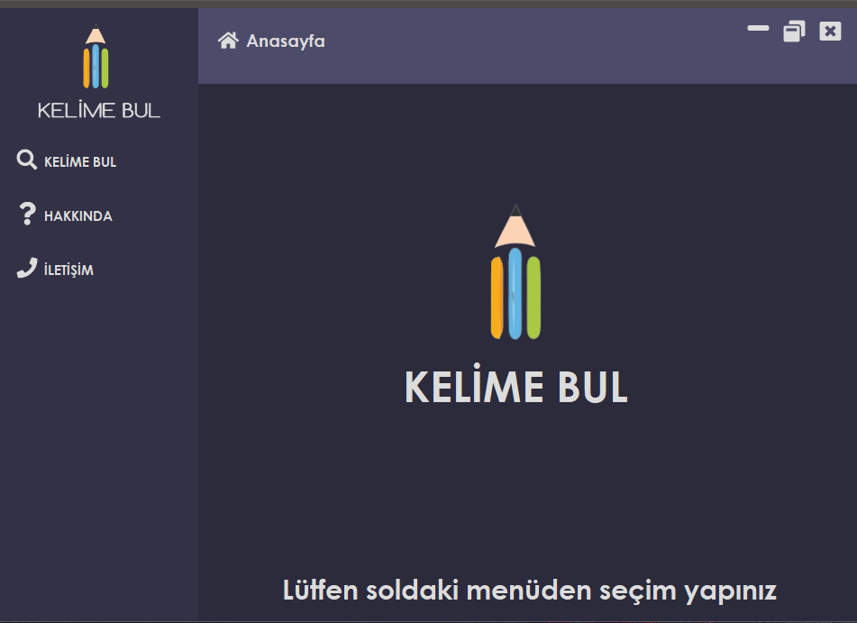
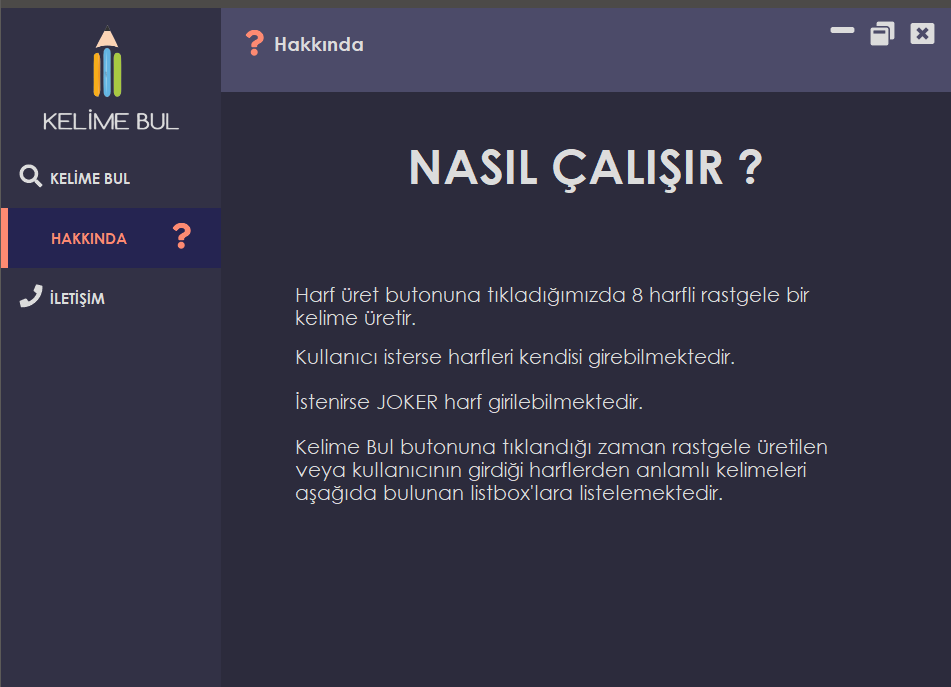
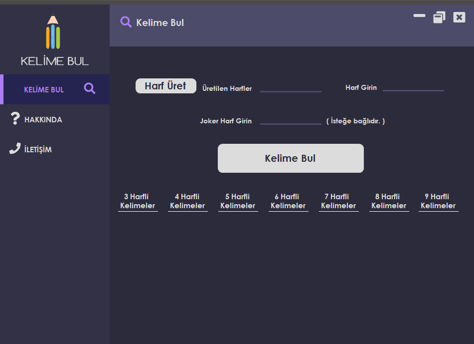
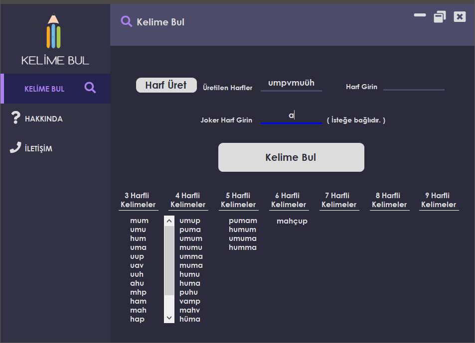
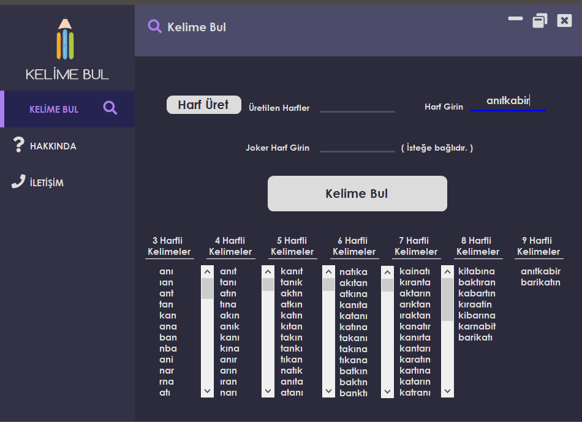
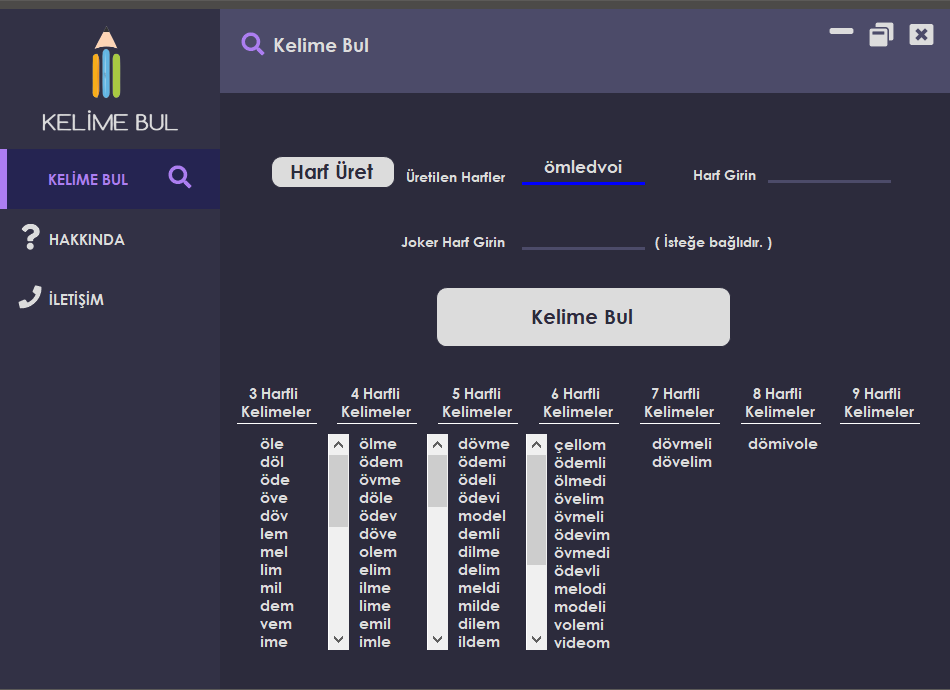

# Random Word Scramble

The computer randomly generates 8 letters. If desired, the user can enter data and wildcard letters can be entered if desired. From these 8 letters, we find the combinations of 8, 3, 4, 5, 6, 7 and 8. If wildcards are entered, the combination process is applied for 9 letters. 
Then, we check each combination found in our 1.3 million txt file with the anagram method and put the meaningful words found in the appropriate listboxes. The anagram method, for example, looks at the letters in the word "cra" and finds that the word "car" is an anagram of each other.

## Screenshots

## Author

- Linkedin: [@acarbaran](https://www.linkedin.com/in/acarbaran/)

## Contributing

Contributions, issues and feature requests are welcome!

Feel free to check `issues page`

  
## License

Copyright © 2022 all rights reserved

